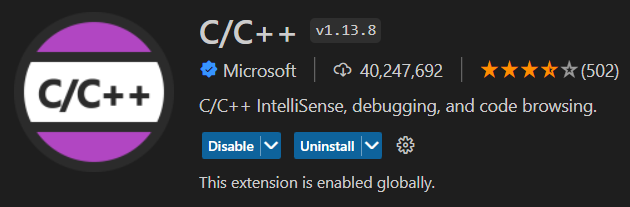

### OpenMP | Алгоритмы
#### Разработка алгоритмов многопоточного программирования при помощи библиотеки OpenMP

- **Задача 1** [code](src/tasks/001.cpp) | [doc](src/docs/task1.md)
- **Задача 2** [code](src/tasks/002.cpp) | [doc](src/docs/task2.md)
- **Задача 3** [code](src/tasks/003.cpp) | [doc](src/docs/task3.md)
- **Задача 4** [code](src/tasks/004.cpp) | [doc](src/docs/task4.md)
- **Задача 5** [code](src/tasks/005.cpp) | [doc](src/docs/task5.md)
- **Задача 6** [code](src/tasks/006.cpp) | [doc](src/docs/task6.md)
- **Задача 7** [code](src/tasks/007.cpp) | [doc](src/docs/task7.md)
- **Задача 10** [code](src/tasks/010.cpp) | [doc](src/docs/task10.md)

### Настройка запуска проекта на разных операционных системах
- **Для запуска программного кода используйте VisualStudioCode**
- C/C++ extension pack от Microsoft 

#### Windows
- Скопируйте код настроек из файла **.vscode/tasks.windows.template.json** и замените им код в файле **.vscode/tasks.json**
#### Linux
- Скопируйте код настроек из файла **.vscode/tasks.linux.template.json** и замените им код в файле **.vscode/tasks.json**
#### MacOS
- Скопируйте код настроек из файла **.vscode/tasks.mac.template.json** и замените им код в файле **.vscode/tasks.json**