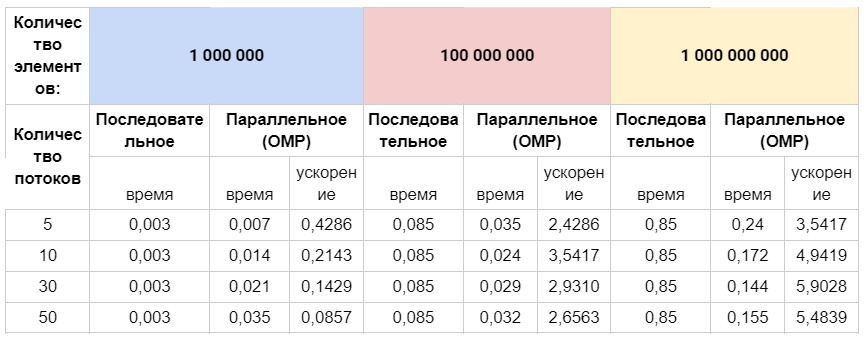
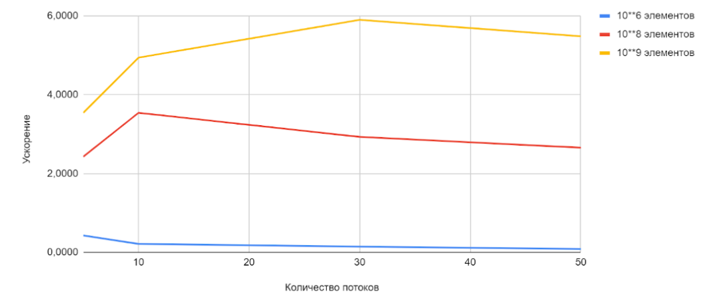

### Задание 1
#### Разработайте программу для нахождения минимального (максимального) значения среди элементов вектора.

#### Решение:
- Для поиска максимального элемента используем алгоритм последовательного перебора массива в цикле for и сравниваем каждое значение с текущим максимальным.
- Цикл используем для возможности сравнения последовательного режима решения с параллельным режимом parallel for.

#### Сравнительная таблица

#### График зависимости ускорения от количества потоков
