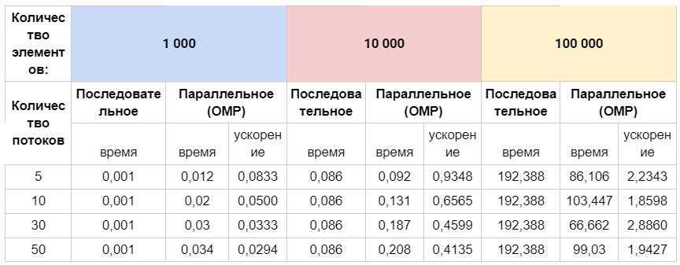
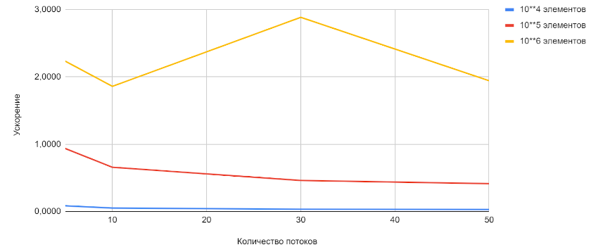

### Задание 10
#### Разработайте программу для задачи 4 с использованием распараллеливания циклов различной вложенности

#### Решение:

#### Сравнительная таблица

#### График зависимости ускорения от количества потоков
