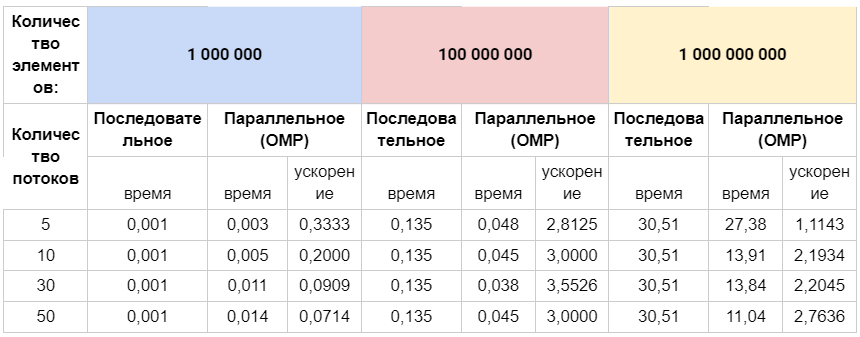
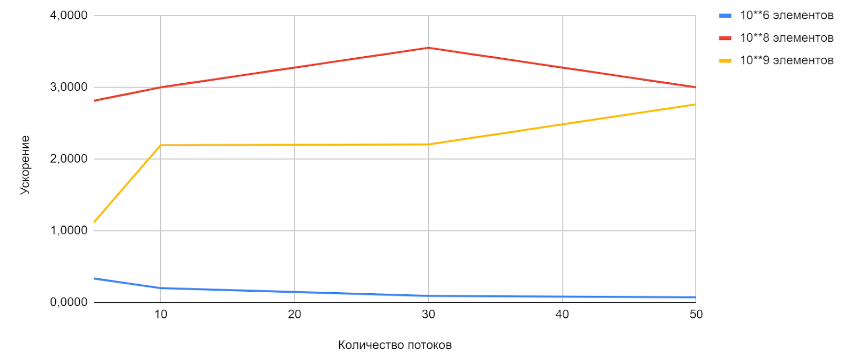

### Задание 2
#### Разработайте программу для вычисления скалярного произведения двух векторов.

#### Решение:
- Для скалярного произведения двух векторов алгоритм последовательного перебора диапазона порядковых номеров элементов массивов в цикле for с последующим их произведением. 

- Цикл используем для возможности сравнения последовательного режима решения с параллельным режимом parallel for.

#### Сравнительная таблица

#### График зависимости ускорения от количества потоков
