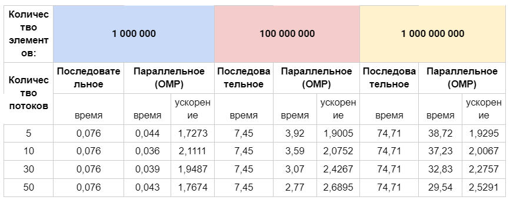
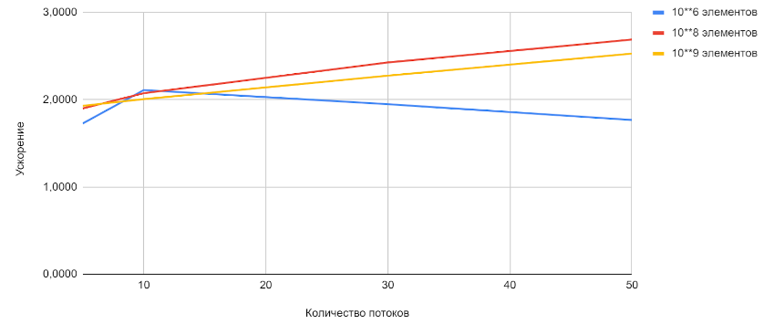

### Задание 3
#### Разработайте программу для вычисления определённого интеграла с использованием метода прямоугольников.

#### Решение:
- Для вычисления определённого интеграла используется алгоритм последовательного перебора диапазона отрезков, на которые был разбит участок в цикле for с последующим вычислением интеграла для каждого участка. 

- Цикл используем для возможности сравнения последовательного режима решения с параллельным режимом parallel for.

#### Сравнительная таблица

#### График зависимости ускорения от количества потоков
