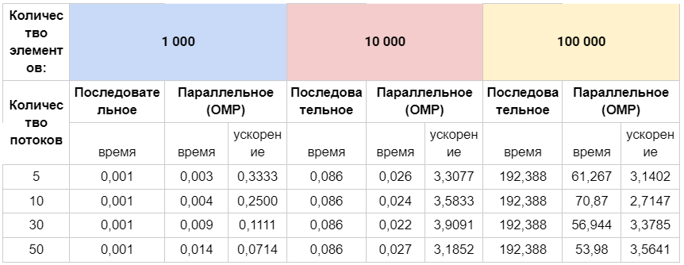
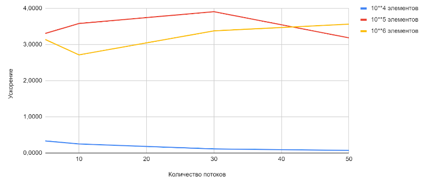

### Задание 4
#### Разработайте программу решения поиска максимального значения среди минимальных элементов строк матрицы

#### Решение:
- Для решение задачи использовались два цикла. Первый цикл вычисляет вектор из минимальных значений строк матрицы. Второй цикл вычисляет максимальное значений из всех значений вектора.
- Циклы используем для возможности сравнения последовательного режима решения с параллельным режимом parallel for.

#### Сравнительная таблица

#### График зависимости ускорения от количества потоков
