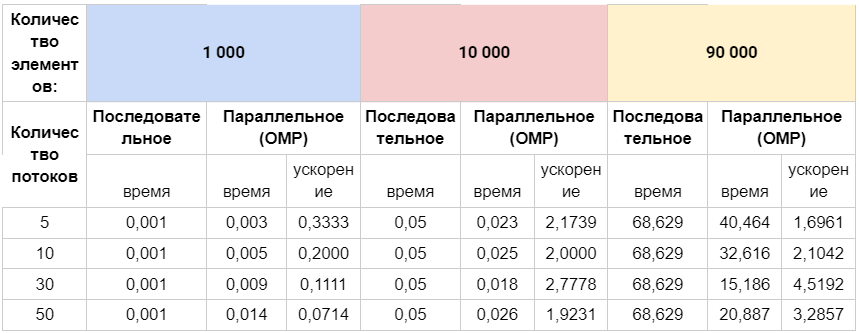
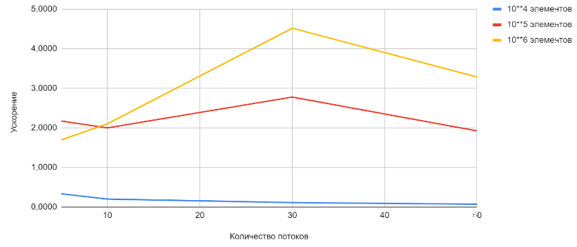

### Задание 5
#### Разработать программу для задания 4 при использовании специального типа матриц: ленточных, треугольных и т.п. Выполнить вычислительные эксперименты при различных правилах распределения итераций между потоками.

#### Решение:
- Для примера решения была взята треугольная верхнеуровневая матрица.
Для решение задачи использовались два цикла. Первый цикл вычисляет вектор из минимальных значений строк матрицы. Второй цикл вычисляет максимальное значений из всех значений вектора.

- Циклы используем для возможности сравнения последовательного режима решения с параллельным режимом parallel for.

#### Сравнительная таблица

#### График зависимости ускорения от количества потоков
