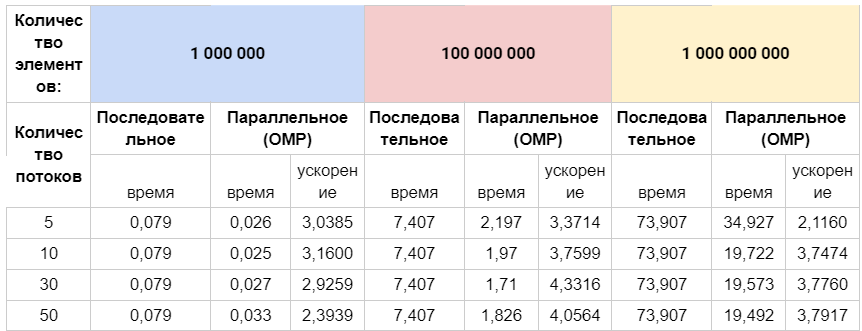
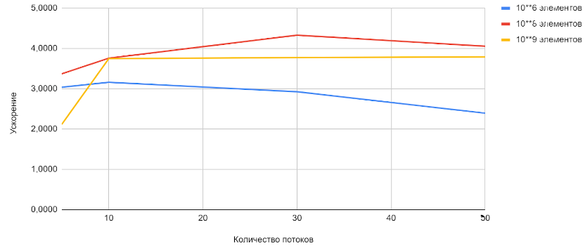

### Задание 6
#### Реализовать операцию редукции с использованием разных способов организации взаимоисключения (атомарные операции, критические секции, синхронизация при помощи замков и т.д.)

#### Решение:
- Для решения задачи был взят алгоритм расчёта определённого интеграла из задания 3.

#### Сравнительная таблица

#### График зависимости ускорения от количества потоков
