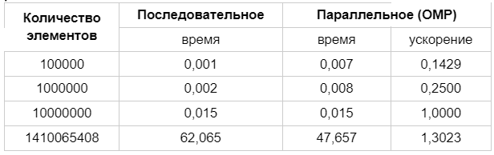
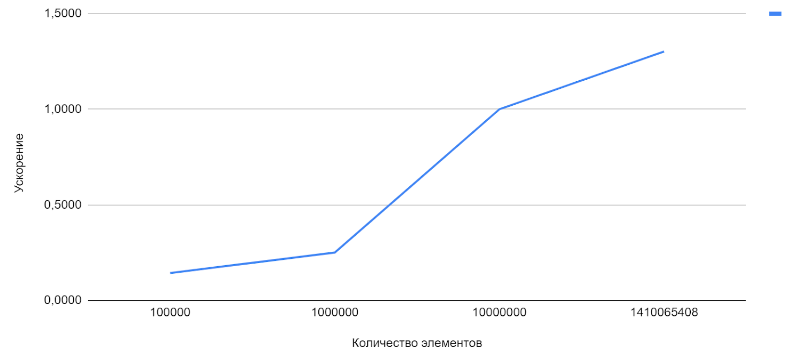

### Задание 7
#### Разработать программу для вычисления скалярного произведения для последовательного набора векторов.

#### Решение:
Для решения задачи будем использовать решение для скалярного произведения из задания 2. В коде задания для распараллеливания добавлены секции. Ускорение работы сравнивается с алгоритмом последовательного выполнения.

#### Сравнительная таблица

#### График зависимости ускорения от количества потоков
